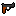
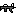
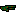
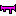
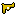
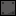
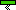
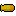

# Risky Robots
A fun game to play with up to 4 friends!

## Guns
### Revolver

The <a href="src/weapons/revolver.py">Revolver</a> is the ultimate medium weapon: it doesn't fire fast or slow, doesn't do much or little damage and doens't have much or little knockback. It's the ultimate middle ground.

### Assault Rifle

The <a href="src/weapons/assaultrifle.py">Assault Rifle</a> is a rapid-firing weapon with low damage and low knockback. It's great when your opponent has a low firing weapon.

### Sniper Rifle

The <a href="src/weapons/sniperrifle.py">Sniper Rifle</a> is a slow firing weapon with a lot of punch behind it: it has the highest knockback of any gun in the game! It also does more damage than most weapons.

### Shotgun

The <a href="src/weapons/shotgun.py">Shotgun</a> is not that fast firing and doesn't do much damage, from afar that is. Up close it can do a lot of damage. If you want to hit multiple opponents or want to wall them out: use the shotgun.

### Rocket Launcher

The <a href="src/weapons/rocketlauncher.py">Rocket Launcher</a> is really slow firing, but what it lacks in speed it makes up for in power: second only to the golden revolver it does the most damage out of all the weapons. It's real power comes from it's area of effect explosion and: the closer you are to the origin of that explosion, the more you have to watch out for future shots with this beast of a weapon.

### Golden Revolver

The <a href="src/weapons/goldenrevolver.py">Golden Revolver</a> shoots an insta-kill bullet.


## Maps
There are currently 3 maps.

### Map 1

<a href="src/maps/maps/map1.txt">Map 1</a> is the basic map: the one where you will duke it out to see who is the best player.

### Map 2

<a href="src/maps/maps/map2.txt">Map 2</a> has a lot of springs, and by a lot I mean a lot: there are springs on the ceiling in the middle, there everywhere!

### Map 3

<a href="src/maps/maps/map3.txt">Map 3</a> is completely made out of mirrors and as we all know, mirrors reflect bullets (don't look it up I swear it's real) so everytime you shoot a bullet, it will bopunce around like crazy.

### Map 4

<a href="src/maps/maps/map4.txt">Map 4</a> is just a mix of all other maps, it has: springs, mirrors, solids and that's it really. But it's still a fun map!

## Modding
In this game modding is both very easy and I encouraged! I would love to see what you can come up with.

### Guns
If you want to mod any guns the weapon files are <a href="src/weapons">here</a>. Simply open a gun you want to change and start changing some values. If you want to change the fire rate of the rocket launcher for example
<br>Change
```python
cooldown = 100
```
To
```python
cooldown = 10
```
For a rocket launcher that shoots 10x faster.

If you want to change bullet images or weapon images, simply replace the <a href="https://github.com/ProfessorQu/Risky-Robots/blob/main/src/assets/weapons/rocketlauncher.png">rocketlauncher.png file</a> with anything you want and then rename it to rocketlauncher.png. You can do anything: you can use Obama's face to destroy your opponents, or even a sprite from your own game!

### Maps
If you want to change the maps to move the player spawn positions, change the layout or just delete the map entirely: you can do that!

Just go to <a href="https://github.com/ProfessorQu/Risky-Robots/tree/main/src/maps/maps">this folder</a> and change any map you'd like.
There are a few things to learn first. "<" and ">" are for mandatory variables while "\[" and "\]" are used for optional ones.

If you want to create a Solid the syntax is the following:
```
Solid <top-left> <top-right> <width> <height>
```
So for example:
```
Solid 50, 100, 200, 50
```
Will create a long, flat rectangle.

Mirrors are exactly the same:
```
Mirror <top-left> <top-right> <width> <height>
```
So for example:
```
Mirror 400, 0, 600, 50
```
Will create a wall in the middle of the map.

Then we have springs which are a little more complicated:
```
Spring <top-left> <top-right> <width> <height> [direction default=UP]
```
They are basically the same as all the other ones, but you can specify a direction if you want a sideways spring. There are four directions: UP, LEFT, DOWN and RIGHT.

Have fun modding!
