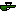

# Risky Robots
A fun game to play with up to 4 friends!

## Guns
### Revolver

The <a href="src/weapons/revolver.py">Revolver</a> is the ultimate medium weapon: it doesn't fire fast or slow, doesn't do much or little damage and doens't have much or little knockback. It's the ultimate middle ground.

### Assault Rifle

The <a href="src/weapons/assaultrifle.py">Assault Rifle</a> is a rapid-firing weapon with low damage and low knockback. It's great when your opponent has a low firing weapon.

### Sniper Rifle

The <a href="src/weapons/sniperrifle.py">Sniper Rifle</a> is a slow firing weapon with a lot of punch behind it: it has the highest knockback of any gun in the game! It also does more damage than most weapons.

### Shotgun

The <a href="src/weapons/shotgun.py">Shotgun</a> is not that fast firing and doesn't do much damage, from afar that is. Up close it can do a lot of damage. If you want to hit multiple opponents or want to wall them out: use the shotgun.

### Rocket Launcher

The <a href="src/weapons/rocketlauncher.py">Rocket Launcher</a> is really slow firing, but what it lacks in speed it makes up for in power: second only to the golden revolver it does the most damage out of all the weapons. It's real power comes from it's area of effect explosion and: the closer you are to the origin of that explosion, the more you have to watch out for future shots with this beast of a weapon.

### Golden Revolver

The <a href="src/weapons/goldenrevolver.py">Golden Revolver</a> shoots an insta-kill bullet.

## Maps
There are currently 3 maps.

### Map 1

<a href="src/maps/maps/map1.txt">Map 1</a> is the basic map: the one where you will duke it out to see who is the best player.

### Map 2

<a href="src/maps/maps/map2.txt">Map 2</a> has a lot of springs, and by a lot I mean a lot: there are springs on the ceiling in the middle, there everywhere!

### Map 3

<a href="src/maps/maps/map3.txt">Map 3</a> is completely made out of mirrors and as we all know, mirrors reflect bullets (don't look it up I swear it's real) so everytime you shoot a bullet, it will bopunce around like crazy.
